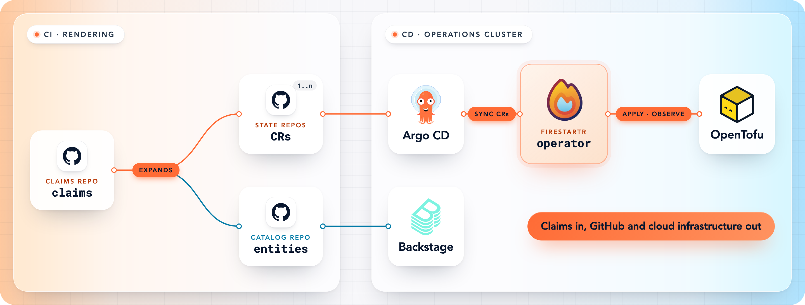

<p align="center">
  
</p>

<h1 align="center">Firestartr</h1>

<p align="center">
  <strong>The GitOps engine behind Firestartr: claims in, GitHub and cloud infrastructure out.</strong>
</p>

<p align="center">
  <a href="https://github.com/firestartr-pro/firestartr/releases/latest"></a>
  <a href="https://github.com/firestartr-pro/firestartr/actions/workflows/pr_verify.yaml"></a>
  <a href="https://github.com/firestartr-pro/firestartr/actions/workflows/e2e.yaml"></a>
  <a href="LICENSE"></a>
  
  
  
</p>

<p align="center">
  <a href="#features">Features</a> ·
  <a href="#how-it-works">How it works</a> ·
  <a href="#packages">Packages</a> ·
  <a href="#getting-started">Getting started</a> ·
  <a href="#delivery">Delivery</a> ·
  <a href="https://docs.firestartr.dev/docs">Docs</a>
</p>

Firestartr is an internal developer platform. Teams declare their software
and ownership as **claims**; this repository renders those claims into
Kubernetes custom resources and reconciles them into GitHub repositories,
teams and workflows, plus the Terraform-managed infrastructure behind them.
For the platform as a whole, see the
[Firestartr documentation](https://docs.firestartr.dev/docs).

## Features

<table>
  <tr>
    <td width="33%" valign="top">
      <h4>☸️ Operator</h4>
      Watches Firestartr custom resources and runs their lifecycle:
      create, sync, observe, and delete.
    </td>
    <td width="33%" valign="top">
      <h4>🧾 Claims renderer</h4>
      Turns claims into custom resources and Backstage catalog entities,
      with defaults, overrides and validations.
    </td>
    <td width="33%" valign="top">
      <h4>🏗️ Terraform provisioner</h4>
      Builds OpenTofu workspaces from inline or remote modules and runs
      plan, apply and destroy.
    </td>
  </tr>
  <tr>
    <td valign="top">
      <h4>🐙 GitHub provisioner</h4>
      Maps repositories, teams, memberships and settings to Terraform
      modules.
    </td>
    <td valign="top">
      <h4>🧩 Repository features</h4>
      Renders workflows, config and docs into component repositories.
    </td>
    <td valign="top">
      <h4>⌨️ CLIs</h4>
      <code>@firestartr/cli</code> drives the platform;
      <code>fs-forge-cli</code> creates and validates claims.
    </td>
  </tr>
</table>

## How it works



**Claims** → rendered by `cdk8s_renderer` → **CRs** in state repositories →
synced by Argo CD → reconciled by the **operator** → provisioned through
`terraform_provisioner` and `gh_provisioner`.

## Packages

| Area | Package | What it does |
|---|---|---|
| Core | [`operator`](packages/operator/) | Watches custom resources and runs their operations. |
| | [`k8s`](packages/k8s/) | Custom resource definitions: the contract between every other package. |
| | [`catalog_common`](packages/catalog_common/) | Shared utilities. |
| | [`github`](packages/github/) | GitHub API access through Octokit. |
| Rendering | [`cdk8s_renderer`](packages/cdk8s_renderer/) | Renders claims into CRs and catalog entities. |
| | [`features_renderer`](packages/features_renderer/) | Renders feature templates into repository files. |
| | [`features_preparer`](packages/features_preparer/) | Prepares features for repositories. |
| | [`scaffolder`](packages/scaffolder/) | Scaffolds new repositories. |
| Provisioning | [`terraform_provisioner`](packages/terraform_provisioner/) | Builds and runs OpenTofu workspaces. |
| | [`gh_provisioner`](packages/gh_provisioner/) | Builds Terraform config for GitHub resources. |
| | [`importer`](packages/importer/) | Imports an existing GitHub organization as claims and CRs. |
| Tooling | [`cli`](packages/cli/) | `@firestartr/cli`, the entry point to every component. |
| | [`fs-forge-cli`](packages/fs-forge-cli/) | Schema-driven CLI to create and validate claims. |
| | [`crs_analyzer`](packages/crs_analyzer/) | Detects drift and errors in CRs and reports them to GitHub. |
| | [`crs_status_service`](packages/crs_status_service/) | Serves live CR status to Backstage. |
| Testing | [`e2e`](packages/e2e/) | End-to-end suites against a live operator and GitHub. |
| | [`test-reporter`](packages/test-reporter/) | Records e2e run metadata as JSON. |

## Getting started

Requirements: Node ≥ 22 and Docker. To run the operator locally you also
need [kind](https://kind.sigs.k8s.io/) and `kubectl`. The e2e suites also need
Go and [Dagger](https://dagger.io/).

```sh
npm ci                        # install every workspace
make build                    # build all packages
cd packages/<name>
npm run lint
ORG=firestartr-test npm test -- --runInBand
```

`make help` lists the other targets. To run the operator in a local cluster,
use `packages/operator/tools/dev-operator.sh`: `startup` creates the cluster
and a dev pod, `start` launches the operator, and `help` lists the rest.

## Delivery

- **Releases** are cut by [release-please](https://github.com/googleapis/release-please)
  from [Conventional Commits](https://www.conventionalcommits.org/).
  `features_renderer` and `fs-forge-cli` are versioned on their own.
- **Images** go to `ghcr.io/firestartr-pro/firestartr` in three flavors:
  `slim`, `full-aws` and `full-az` (for `linux/amd64` and `linux/arm64`),
  built for snapshots, pre-releases and releases. See
  [`.github/BUILD_AND_DISPATCH_DOCKER_IMAGES_README.md`](.github/BUILD_AND_DISPATCH_DOCKER_IMAGES_README.md).
- **npm packages:** `@firestartr/cli`, `@firestartr/fs-forge-cli`,
  `@firestartr/firestartr-features_renderer` and
  `@firestartr/firestartr-claims_schemas`.

## Documentation

- [Firestartr documentation](https://docs.firestartr.dev/docs): the platform,
  its concepts and how to operate it.
- [`docs/public`](docs/public/README.md): the configuration and state
  repositories.
- [`docs/claims`](docs/claims/README.md): the claim reference.
- [`docs/adr`](docs/adr/README.md): architecture decisions.

## Contributing

[`CONSTITUTION.md`](CONSTITUTION.md) holds the repository rules, and each
package may add its own `RULES.md`. Agents also follow
[`AGENTS.md`](AGENTS.md).

## License

[Apache-2.0](LICENSE)
