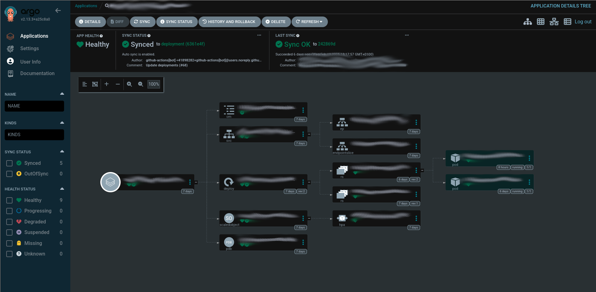

# Introduction

Lately, we have the need to migrate old state repos to our new app state repo structure. This article will describe the steps needed to be followed to properly do this migration. Note that the following steps should be done in a `dev` or `pre` environment first, and once everything is working then applied to the `pro` environment (during an intervention window which must be request beforehand).

### Step 0: 🛠️ prerrequisites

Go to the `charts` repo of the organization and locate the `deployment.yaml` file (or equivalent, such as `statefulset.yaml`, `daemonset.yaml`, etc.) for the application of the repo you are updating. Update the following line in the **annotations of the deployment** (not the pod):

```yaml
annotations: {{ .Values.global.annotations | toYaml | nindent 2 }}
```

To:

```yaml
annotations:
  {{- if .Values.global.annotations }}
  {{ .Values.global.annotations | toYaml | nindent 2 }}
  {{- end }}
  firestartr.dev/image: {{ .Values.image }}
  firestartr.dev/microservice: {{ .Chart.Name }}
```

And then update the chart's version number. Create a PR with these changes and once it's merged the new chart will be published.

### Step 1: 📂 creating the repo

If not already done, create the new state repo claim and install the latest version `state_repo_apps` feature (`v2` at the time of writing). The recommended name nomenclature for state repos we are currently using is `app-<application-name>`.

Once the repo has been created, you will also need to create the folder structure (see [state apps main/master branch](./state-apps-repository.md#-main-or-master-branch)) and copy the corresponding environment folder and `YAML` file for the `cluster/tenant` pair that is going to be migrated. You can copy all the environments at once as long as you don't change the state repo the `make_dispatches.yaml` config dispatches to (see [Leaving pro dispatching to the old state repo](#-leaving-pro-dispatching-to-the-old-state-repo) and [make_dispatches config](https://github.com/prefapp/features/blob/main/packages/build_and_dispatch_docker_images/templates/docs/README.md#make-dispatches)), but it's recommended to migrate environments one by one whenever possible.

Once the repo has been created, give the Argo notifications GitHub app [the necessary permissions to make it work](./state-apps-repository.md#-setup) over the new repo.

To be able to do pull of the charts, if they are private, add in Settings > Secrets and variables > Actions > Variables > New repository variable > DOCKER_REGISTRY_RELEASES=registryName

### Step 2: 🔄 updating the chart and it's version

In the new state repo, the copied `<platform>/<tenant>/<env>/<env>.yaml` files are incomplete and need updating. Update them:

```yaml
namespace: chart-namespace
version: <old-version>
```

To:

```yaml
namespace: chart-namespace
version: <new-version>
chart: <chart-name-in-repo>
hooks: []
extraPatches: []
remoteArtifacts: []
execs: []
set:
  - name: "global.chart_version"
    value: "{{ .StateValues.version }}"
```

If the `namespace` also needs to be updated, it can be done now too. Note that doing so will require additional steps to be done, as described [here](#-when-also-updating-the-deployments-namespace)

### Step 3: 🛠️updating the .firestartr configuration

Some files may be missing from the `.firestartr` configuration repository (usually the `app` configuration file) so create them as needed. See the [.firestartr section](./The-dot-firestartr-repository.md) to learn more about `.firestartr`, its folder structure and the configurations within.

### Step 4: 🔧 updating make_dispatches in the code repo

In the `claims` repository, go to the code repo claim and update (or install, if not already done) the `build_and_dispatch_docker_images` feature to the latest version available (`v5` at the time of writing).

Once the installation has been completed, `.github/make_dispatches.yaml` needs to be updated to the new format (or created, if it's a new installation). Here's an example:

Old format:

```yaml
dispatches:
  - type: snapshots
    flavors:
      - flavor-1
    state_repos:
      - repo: state-repo
        dispatch_event_type: "dispatch-image-v5"
        base_path: apps
        tenant: my-tenant
        application: app-1 
        env: dev
        service_names: ['service-1']
        version: $branch_dev
        registry: registry.overwrite
        image_repository: img_repo/overwrite
```

New format from v4:

```yaml
deployments:  # <- Notice how "dispatches" was changed to "deployments"
    # Ensure the platform matches the one specified in the platforms directory in the .firestartr configuration repository.
      # name: cluster-1 in .firestartr/platforms/cluster-1.yaml file
    # Ensure the platform matches with the path segment corresponds to the cluster name in the application's state repository.
      # app-<application>/kubernetes/cluster-1
  - platform: cluster-1
    # Ensure the tenant matches the one specified in the platforms directory in the .firestartr configuration repository.
      # tenants: [tenant-1, tenant-2] in .firestartr/platforms/cluster-1.yaml file
    # Ensure the tenant matches with the path segment corresponds to the tenant name in the application's state repository.
      # app-<application>/kubernetes/cluster-1/tenant-1
    tenant: tenant-1
    # Ensure the application matches the one specified in the apps directory in the .firestartr configuration repository.
      # name: app-1 in .firestartr/apps/app-1.yaml file
    application: app-1 
    # Ensure the env matches the one specified in the platforms directory in the .firestartr configuration repository.
      # envs: [dev, pre] in .firestartr/platforms/cluster-1.yaml file
    # Ensure the env matches with the path segment corresponds to the environment name in the application's state repository.
      # app-<application>/kubernetes/cluster-1/tenant-1/dev
    env: dev
    # Ensure the service matches the one specified in the apps directory in the .firestartr configuration repository.
      # services:
      #   - repo: org/service-1
      #     service_names: [service-1]
    # Ensure the service matches with the top-level key corresponds to the service name in the application's state repository.
      # app-<application>/kubernetes/cluster-1/tenant-1/dev/serive-1-values.yaml file
    service_names: ['service-1']
    type: snapshots # Support snapshots and releases
    flavor: flavor-1 # Set on build_images.yaml file on the same folder
    version: $branch_dev # Support $branch_<branch_name>, $latest_prelease and $latest_release
    registry: registry.overwrite # Optional, only use if it was in the original config (old). For the rest of the cases it can be set but it is appropriate to take it from the organization's action variable (or by overwriting the repository's action variable) in the service repository's setting area.
    # Ensure the image_repository matches the repo key in the apps directory in the .firestartr configuration repository.
      # services:
      #   - repo: org/service-1
      #     service_names: [service-1]
    image_repository: org/service-1 # Optional, only use if it was in the original config. For the rest of the cases it can be configured but it is appropriate to let it take it from what was explained before.
    dispatch_event_type: "dispatch-image-v5" # Optional, only use if it was in the original config (old)
    # Ensure the state_repo matches the one specified in the apps directory in the .firestartr configuration repository.
      # state_repo: "org/app-<application>" in .firestartr/apps/app-1.yaml file
    state_repo: state-repo-1 # Optional, only use if it was in the original config (old). For the rest of the cases it can be set but it is appropriate to take it from the organization's action variable (or by overwriting the repository's action variable) in the service repository's setting area.
```

To learn more about the new config format and its parameters, read [make_dispatches config](https://github.com/prefapp/features/blob/main/packages/build_and_dispatch_docker_images/templates/docs/README.md#make-dispatches)

In the case of updating a `make_dispatches.yaml` file which contains one or more working `pro` environment configurations, see [this section](#-leaving-pro-dispatching-to-the-old-state-repo)

NOTES:
- Make sure the `build_and_dispatch_docker_images` feature is installed in the code repository from the corresponding `component` claim and at least version `5.0.1`. It should contain at least these arguments in `providers.github.features.build_and_dispatch_docker_images.args`:
  - `build_snapshots_branch: '<branch>'` # The branch that will trigger the dispatch of the snapshots.
  - `build_snapshots_filter: ''`
  - `build_pre_releases_filter: ''`
  - `build_releases_filter: ''`
  - `default_snapshots_flavors_filter: '*'`
  - `default_pre_releases_flavors_filter: '*'`
  - `default_releases_flavors_filter: '*'`
  - `firestartr_config_repo: 'org/.firestartr'` # Where org is the organization of the Firestartr configuration repository.
- If the branch set in `build_snapshots_branch` is not the default branch of the service code repository, once the `build_and_dispatch_docker_images` feature has been updated and the `make_dispatches.yaml` file has been migrated to the new model, bring the content of the main branch (where everything described above has been applied) to the `build_snapshots_branch` so that the new dispatch model is available.
- Take advantage of the changes promoted in the code repository claim to update and add the necessary permissions, in effect, those of `platformOwner` that concern us and that you can find in the files of the `groups` directory of the same claims repository. Eventually like this: `platformOwner: group:infra`.

### Step 5: 🛡️ create the Argo project and application set files

Over at the `state-argocd` repository, create a folder for the new app and add these two files to it:

```yaml
# apps/<application-name>/argo-<application-name>.ApplicationSet.yaml
---
apiVersion: argoproj.io/v1alpha1
kind: ApplicationSet
metadata:
  name: app-<application-name>
  namespace: argocd
spec:
  generators:
  - git:
      directories:
      - path: <technology.type>/*/*/*  # technology.type -> kubernetes, vmss, etc. as defined by the cluster configuration in the .firestartr repo
      repoURL: https://github.com/<org>/<new-state-repo>.git
      revision: deployment
      values:
        <cluster1-name>: <cluster1-url>
        <cluster2-name>: <cluster2-url>
        <cluster3-name>: <cluster3-url>
        ...
  goTemplate: true
  goTemplateOptions:
  - missingkey=error
  template:
    metadata:
      name: 'app-<application-name>-{{index .path.segments 1}}-{{index .path.segments 2}}-{{index .path.segments 3}}'
    spec:
      destination:
        namespace: '{{index .path.segments 2}}-<application-name>-{{index .path.segments 3}}'
        server: '{{index .values (index .path.segments 1)}}'
      project: 'app-<application-name>'
      source:
        path: '{{index .path.segments 0}}/{{index .path.segments 1}}/{{index .path.segments 2}}/{{index .path.segments 3}}'
        repoURL: https://github.com/<org>/<new-state-repo>.git
        targetRevision: deployment
      syncPolicy:
        automated: null
        syncOptions:
        - CreateNamespace=true
```

```yaml
# apps/<application-name>/argo-<application-name>.Project.yaml
---
apiVersion: argoproj.io/v1alpha1
kind: AppProject
metadata:
  name: app-<application-name>
  namespace: argocd
spec:
  description: <application-name> State Project  # Obviously any description is valid
  clusterResourceWhitelist:
  - group: rbac.authorization.k8s.io
    kind: ClusterRole
  - group: rbac.authorization.k8s.io
    kind: ClusterRoleBinding
  - group: ""
    kind: Namespace
  - group: networking.k8s.io
    kind: IngressClass
  sourceRepos:
  - "https://github.com/<org>/<new-state-repo>.git"
  destinations:
  - namespace: <tenant1-env1-application-namespace>
    server: <tenant1-env1-cluster-url>
  - namespace: <tenant2-env1-application-namespace>  # Add only the namespaces and clusters that you plan to configure and deploy
    server: <tenant2-env1-cluster-url>
  # - namespace: "<tenant1-env2-application-namespace>"  # <- You can add not yet configured namespaces and clusters as comments, and uncomment them with necessary
  #   server: <tenant1-env2-cluster-url>
```

In this example, the branch used is `deployment`, by default this orphan branch will be created in the app-<application-name> state repo to host the templated artifacts.

### Step 6: 🗑️ uninstall previous helm release

Before creating your first deployment, go ahead and uninstall the old release like this:

`helm --namespace <namespace> uninstall <release>` (use the old namespace if it was updated in [the second step](#step-2--updating-the-chart-and-its-version))

Notes:
- It's important to check that when deleting a release, all the artifacts associated with it have been deleted, particularly those that provision or attach resources from a provider (LoadBalancer Services, PersistentVolumes, etc)
- Artifacts applied via hooks do not belong to the release and therefore must be removed manually.
- Additionally, it would be advisable to block the deployment of a new release from the push repository, i.e., before deleting the old state, it should be blocked, for example by deleting the environment in the helmfile.

### Step 7: 🚀 render the first deployments

Once all the previous steps have been completed, you can do a render of the relevant environments either directly in the state repo or by doing a dispatch from the code repo. A PR will be created for each environment. Review them and merge the changes if no errors are found (it's recommended to go one by one instead of merging them all at the same time).

### Step 8: ✅ check everything is OK

Go to the Argo control panel and confirm the Application Set has been correctly created (go to the **Applications** section in the left hand menu). To connect to ArgoCD, open `k9s`, port-forward `argocd-server` (`Shift + F` to port-forward) and log into `localhost:<port-forwarded-port>` with `admin` and the decoded `argo-initial-admin-secret` secret (`X` to decode) or use de `kubectl` command:

##### To establish a port-forward connection to the ArgoCD server:

```bash
kubectl port-forward svc/argocd-server --namespace argocd <local-forwarded-port>:80
```

##### To decode the `argo-initial-admin-secret` secret:

```bash
kubectl get secret argocd-initial-admin-secret -n argocd -o jsonpath="{.data.password}" | base64 --decode
```

Then, go to the **Applications** section in the left hand menu and check the application has been created. If it hasn't, check the logs of the `argocd-application-set-controller` pod.


You may need to manually synchronize it if its status is reported as `missing`. Then check the pods have also been created inside the Kubernetes cluster.


Check any connections that might have changed between pods, if needed.

**Note:** Some things might *not* be right. The ArgoCD deployment may give you temporary synchronization problems, or there may be connection issues between pods. Please check everything thoroughly, *specially* if it's the first environment you are migrating for this application. Take note of any additional steps this guide may have missed and do them on subsequent app environment migrations.

### Step 9: cleaning up old files

The last thing needed to be done is the deletion of obsolete configuration files:

- In the new state repo, create a PR deleting all of the `<env>/images.yaml` files of the environments that where correctly deployed, and merge the changes.
- In the old state repos, delete the `<application>/<env>` folder of each environment that was correctly deployed. If, for a given application, all of its environments are already deployed, delete the whole `<application>` folder instead

### 📝 Leaving pro dispatching to the old state repo

In order to update an existing `make_dispatches.yaml` file's `dev` and `pre` environments so they dispatch to the new state repo while leaving `pro` to dispatch to the old environment, additional steps need to be taken.

First, `make_dispatches@v3` state repo's use a different process to dispatch, and create the path to update as follows: `<platform.type>/<platform>/<tenant>/<env>`. This has changed substantially from the previous version, which dispatched using `<base_path>/<tenant>/<application>/<env>` as its path. However, the payload `make_dispatches` sends to either repo is the same, and the only change that has happened between versions is that new fields have been added, which will be ignored by previous versions of the state repo workflow. Internally, the `base_path` keeps being sent in the payload, but it's composed as `<platform.type>/<platform>` instead of using the value of the config file when found. This means we can keep backwards compatibility with a little bit of creativity:

1. Over in the `.firestartr` repository, create a new platform configuration file for each `base_path` value you need to support, as follows:

```yaml
# platforms/legacy.yaml (or platforms/legacy-<base_path>.yaml when multiple <base_path> values need to be supported)
type: ''  # Leave this parameter empty
name: <base_path>  # Set the old base_path value 
tenants: [tenant1, tenant2, tenant3, ...]  # Add whichever tenants need to be supported by the legacy repo
envs: [dev, pre, pro]  # Add whichever environments need to be supported by the legacy repo
```

Since `platform.type` has no value, the resulting `base_path` for any dispatch using this platform configuration will be just whatever `platform.name` we specified, giving us the old behavior while keeping the new configuration style.

2. In the `make_dispatches.yaml` config of the code repo, update all the environments you want to dispatch to the old state repo as follows:

Old version:

```yaml
- type: releases
  flavors:
    - default
  state_repos:
    - repo: <old-state-repo>
      base_path: <base_path>
      tenant: <tenant>
      dispatch_event_type: "dispatch-image-v5"
      application: <app>
      env: pro
      service_names: ['service']
      version: $latest_release
```

New version from v4:

```yaml
- tenant: <tenant>
  platform: <base_path>  # As discussed in the previous step, create a platform with the name <base_path> and set it as the new platform
  type: releases
  flavor: default  # Create an additional deployment if the previous config had more than one flavor
  dispatch_event_type: "dispatch-image-v5"  # Not needed with the new state repositories per application (app-xxx)
  application: <application>
  env: pro
  state_repo: <org>/<old-state-repo>  # The state_repo field now must include the organization
  service_names: ['service']
  version: $latest_release
```

With that, the `pro` environment dispatch should still go to the old state repository.

### 🔄 When also updating the deployment's namespace

If the namespace also needs to be updated when migrating the state repo (because, for example, the old one was too broad and more specific namespaces are desired), a couple of extra steps need to be taken:

- Change the `namespace` field of the `<env>.yaml` file
- Look up the old namespace on the organization's repositories, and update it on whatever files are necessary.
- When checking if everything is working, also check any connections that use the new namespace.

### 🔐 Migrating secrets from an external provider to ExternalSecrets

In order to migrate secrets from an external provider (e.g. Azure KeyVault) into a Kubernetes ExternalSecrets object, go to the `state-sys-services` repo and do the following:

1. Create the folders necessary for your application if not already done, following [this structure](./state-sys-services-repository.md#-main-or-master-branch)
2. Create an additional `extra_artifacts` folder inside `kubernetes-sys-services/<cluster>/<application>` with the following files:

```yaml
# external_secret.yaml
apiVersion: external-secrets.io/v1beta1
kind: ExternalSecret
metadata:
  name: <cluster>-<application>
spec:
  refreshInterval: 1h
  secretStoreRef:
    name: <cluster>-<application>
    kind: SecretStore
  target:
    name: <cluster>-<application>
    creationPolicy: Owner
  data:
  - secretKey: <kubernetes-secret-key-name-1>
    remoteRef:
      key: <remote-secret-key-name-1>
  - secretKey: <kubernetes-secret-key-name-2>
    remoteRef:
      key: <remote-secret-key-name-2>
  - secretKey: <kubernetes-secret-key-name-3>
    remoteRef:
      key: <remote-secret-key-name-3>
  ...
```

```yaml
# secret_store.yaml
apiVersion: external-secrets.io/v1beta1
kind: SecretStore
metadata:
  name: <cluster>-<application>
spec:
  provider:
    azurekv:  # This object key name and its fields differ between providers. See https://external-secrets.io/latest/introduction/overview/ for documentation
      authType: WorkloadIdentity
      vaultUrl: <az-keyvault-url>
      serviceAccountRef:
        name: <cluster>-<application>
```

```yaml
apiVersion: v1
kind: ServiceAccount
metadata:
  name: <cluster>-<application>
  annotations:  # The annotations' names and values will differ between providers. See https://external-secrets.io/latest/introduction/overview/ for documentation
    azure.workload.identity/client-id: <az-client-id>
    azure.workload.identity/tenant-id: <az-tenant-id>
```

### 🔑 Migrating secrets from an external secret provider to Kubernetes CSI

In order to migrate secrets from an Azure KeyVault or AWS Parameter Store into a Kubernetes CSI, go to the `state-sys-services` repo and do the following:

1. Create the folders necessary for your application if not already done, following [this structure](./state-sys-services-repository.md#-main-or-master-branch)
2. Create an additional `extra_artifacts` folder inside `kubernetes-sys-services/<cluster>/<application>` with the following file:

```yaml
# secrets.yaml (AZ Keyvault example)
<application>:
    kvSecrets:
        - kv: <keyvault-1>
          data:
            <kubernetes-env-variable-1>: <keyvault-secret-name-1>  # The keyvault secret with the name <keyvault-secret-name-1> will become a environment variable with the name <kubernetes-env-variable-1> inside the pod
            <kubernetes-env-variable-2>: <keyvault-secret-name-2>  # The keyvault secret with the name <keyvault-secret-name-2> will become a environment variable with the name <kubernetes-env-variable-2> inside the pod
            ...

        - kv: <keyvault-2>
          data:
            <kubernetes-env-variable-3>: <keyvault-secret-name-3>  # The keyvault secret with the name <keyvault-secret-name-3> will become a environment variable with the name <kubernetes-env-variable-3> inside the pod
            <kubernetes-env-variable-4>: <keyvault-secret-name-4>  # The keyvault secret with the name <keyvault-secret-name-4> will become a environment variable with the name <kubernetes-env-variable-4> inside the pod
            ...

        - ...
```

[Additional documentation](https://secrets-store-csi-driver.sigs.k8s.io/getting-started/usage)
